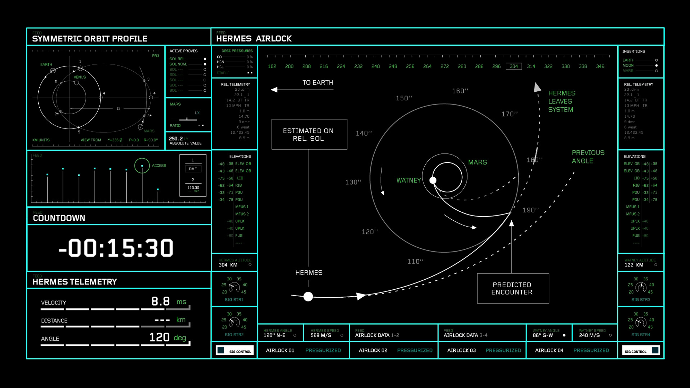
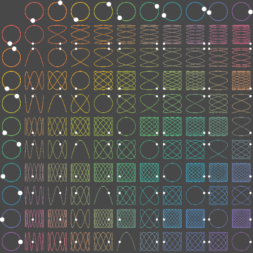

# Bevy Jam 5 - Theme: Cycles

> [!NOTE] 
> **Goals**
> 1. Program and visualize orbits and communications links
> 2. Complete game loop and experience — no placeholders
> 3. Learn Bevy

## Idea 1: `( S O L )         S U R V I V O R           ◦.`

Core Gameplay:

- N-body physics and orbits create natural cycles
- Satellite management combines resource management with skill-based navigation

Progression:

1. Start with one satellite
2. Manage orbits using arrow keys
3. Earn money from successful links
4. Expand fleet or upgrade existing satellites

Gameplay Loops:

- Short-term: Orbit adjustment and conjunction avoidance
- Mid-term: Resource management (power, money, upgrades)
- Long-term: Fleet expansion and optimization

Suggested Additions:

- Periodic events like solar flares or meteor showers
- Day/night cycles affecting power generation
- Atmospheric drag increasing over time, requiring periodic boosts
- Rotating ground stations to create dynamic link opportunities

Visual Style:

- Use a color palette similar to the image (black background, green graphics)
- Implement a CRT shader effect for authenticity
- Add subtle scan lines and screen curvature

Audio:

- Lo-fi background music
- Retro blips and beeps for UI interactions
- Low, ominous tones for warnings

Stretch Goals:

- Orbiting debris that returns periodically
- Recurring mission types tied to celestial events
- Upgrade cycles where old satellites can be recycled for parts

## Idea 2: `phase_shift`

[inspiration - lissajous tutorial](https://www.youtube.com/watch?v=t6nGiBzGLD8)

- Oscilloscope vibe
- Bullet hell
- Your bullets take the path of a lissajous pattern
    - projectile follow the line slow to medium speed like theyre on a zipline, kinda like the dots on the image below
    - the lissajous pattern has an “end” to the line. Each projectile gets one cycle on the pattern
    - You realistically only get “low frequency” lissajous, so your projectiles dont last forever, but it is possible to get crazy game breaking ones.
- You can get upgrades to increase the frequency of your pattern
    - you get x upgrades and y upgrades
    - Frequency and Amplitude upgrades
    - You have a limited number of projectiles that replenish with time
- the longer your lissajous pattern the longer the projectiles stay on the screen, but the more complex and erratic their pattern so you have less aim, but technically more firepower on screen at once
- You can get items that make your lissajous path go crazy and it makes the bullets go crazy all over the screen.
    - These are like the audio impulse weapons that make a mushroom shape. or a world or spring, ect.
    - They allow your projectiles to hit enemies at multiple Hz effectively being screen clear/ bomb items
- Bosses can inflict audio disturbances to your line that can shake projectiles off it.
    - Like maybe the bass builds through the boss fight in a cycle, each beat perturbing your line a bit more till the projectiles just shake off and fly in random directions both harming boss and you.
