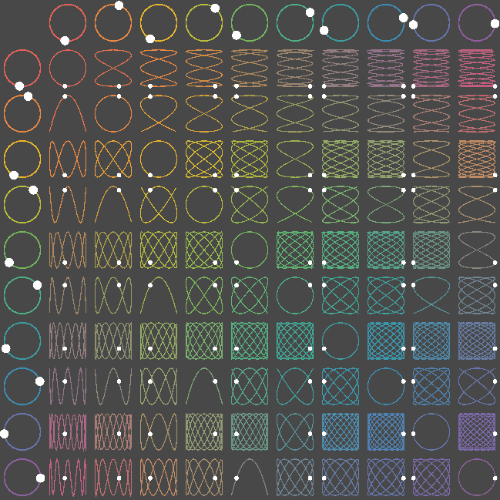

# Concept `phase_shift_`

Phase Shift is a bullet hell rhythm game created for
[Bevy Jam #5](https://itch.io/jam/bevy-jam-5) with the theme: **cycles**.

## Credits
David Breen - Concept

Philip Linden - Concept dev & code

## Platform
Although Bevy is cross-platform, the focus of this project is to build for web
and host it on itch.io in an embedded Web Assembly player.

## Gameplay
Core Gameplay:

- Change parameters of two waveforms, displayed as a Lissajous pattern.
- Control the X phase with A and D, control the Y phase with W and S.
- Bullets are locked on rails to the Lissajou pattern and traverse the pattern
  for the duration of one period.
- Left click to fire bullets whose lifetime is tied to the X waveform period,
  and Right click to fire bullets whose lifetime is tied to the Y waveform
  period.
- Shooting consumes a (rechargeable) resource called _charge_.
- "Anomalies" are the target for bullets. Anomalies add a resource called _heat_
  which is the player's damage bar. If this bar fills, the game ends.

Progression:

- Spend charge to fire bullets or buy upgrades.
- Upgrades increase frequency, amplitude, or charge capacity, or to reduce heat.
- Allow infinite upgrades, to ridiculous results.

Stretch Goals:

- The X and Y waveforms map directly to Left and Right audio channels, including
  game sound effects, UI blips and beeps, and music.
- the longer your lissajous pattern the longer the projectiles stay on the
  screen, but the more complex and erratic their pattern so you have less aim,
  but technically more firepower on screen at once
- You can get items that make your lissajous path go crazy and it makes the
  bullets go crazy all over the screen.
    - These are like the audio impulse weapons that make a mushroom shape. or a
      world or spring, ect.
    - They allow your projectiles to hit enemies at multiple Hz effectively
      being screen clear/ bomb items
- Bosses can inflict audio disturbances to your line that can shake projectiles
  off it.
    - Like maybe the bass builds through the boss fight in a cycle, each beat
      perturbing your line a bit more till the projectiles just shake off and
      fly in random directions both harming boss and you.

## Look & Feel
The interface looks like a classic analog oscilloscope. Changing parameters with
upgrades or user inputs directly reflects the turning of dials.

Heavy inspiration from radar displays, analog oscilloscopes, and early 80's
"sci-fi" computer terminals. Vaporwave background music, retro blips and beeps
for UI interactions. Muted color palette of slate gray and pure green, with pure
red warnings. No solid faces, only wireframes of primitive shapes. CRT-effects,
intense bloom, and video glitches during anomalies.

[inspiration - lissajous tutorial](https://www.youtube.com/watch?v=t6nGiBzGLD8)

- Oscilloscope vibe
- Bullet hell
- Your bullets take the path of a lissajous pattern
    - projectile follow the line slow to medium speed like theyre on a zipline, kinda like the dots on the image below
    - the lissajous pattern has an “end” to the line. Each projectile gets one cycle on the pattern
    - You realistically only get “low frequency” lissajous, so your projectiles dont last forever, but it is possible to get crazy game breaking ones.
- You can get upgrades to increase the frequency of your pattern
    - you get x upgrades and y upgrades
    - Frequency and Amplitude upgrades
    - You have a limited number of projectiles that replenish with time
- the longer your lissajous pattern the longer the projectiles stay on the screen, but the more complex and erratic their pattern so you have less aim, but technically more firepower on screen at once
- You can get items that make your lissajous path go crazy and it makes the bullets go crazy all over the screen.
    - These are like the audio impulse weapons that make a mushroom shape. or a world or spring, ect.
    - They allow your projectiles to hit enemies at multiple Hz effectively being screen clear/ bomb items
- Bosses can inflict audio disturbances to your line that can shake projectiles off it.
    - Like maybe the bass builds through the boss fight in a cycle, each beat perturbing your line a bit more till the projectiles just shake off and fly in random directions both harming boss and you.
