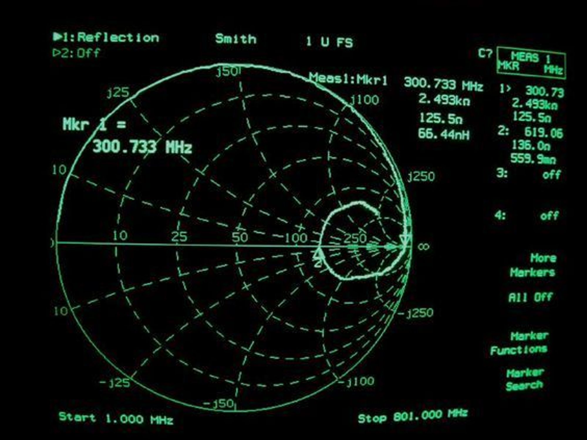
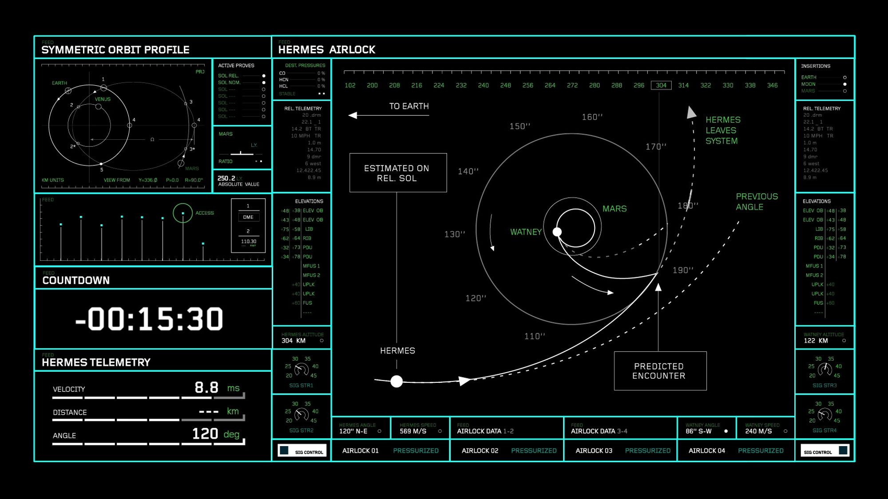

# Concept - `( S O L )         S U R V I V O R           ◦.`
_Grow a fleet of satellites and keep your business alive through solar cycles_
_and other anomalies. Upgrade your satellites or strength in numbers? Use lunar_
_cycles and orbital resonance to your advantage? Strategize and adapt to_
_changing conditions. Beware---the Sun is angry this year._

Sol Survivor is a tower-defense idle game created for
[Bevy Jam #5](https://itch.io/jam/bevy-jam-5) with the theme: **cycles**.

## Platform
Although Bevy is cross-platform, the focus of this project is to build for web
and host it on itch.io in an embedded Web Assembly player.

## Gameplay
Core Gameplay:

- N-body physics and orbits create natural cycles in a Sun-Earth-Moon system.
- Satellite management combines resource management with upgrade-based progression.
- Satellites use power to establish links to ground stations, which earns money.
- Satellites gain power when there is direct line-of-sight to the sun.

Progression:

1. Start with one satellite
2. ~~Manage orbits using arrow keys~~ Click for a circular orbit. Click and drag for an elliptical orbit. Cost is calculated by an approximate scale proportional to how "exotic" or energetic the orbit is.
3. Earn money from successful links to ground stations
4. Expand fleet or upgrade existing satellites

Challenges:

- Periodic events like solar flares or meteor showers
- Day/night cycles affecting power generation
- Atmospheric drag increasing over time, requiring periodic boosts
- Rotating ground stations to create dynamic link opportunities

Stretch Goals:

- Orbiting debris that returns periodically, space junk, and neighboring satellites.
- Recurring mission types tied to celestial events.
- Adjustable orbits with satellite propulsion and fuel systems.

## Look & Feel
"Cassette Futurism" aesthetic, drawing from films _Alien_ (1979) and _WarGames_
(1983), anime _Cowboy Bebop_ (1998), and tabletop role-playing game
_Death In Space_ (2022).

Heavy inspiration from radar displays, analog oscilloscopes, and early 80's
"sci-fi" computer terminals. Vaporwave background music, retro blips and beeps
for UI interactions. Muted color palette of slate gray and pure green, with pure
red warnings. No solid faces, only wireframes of primitive shapes. CRT-effects,
intense bloom, and video glitches during anomalies.

